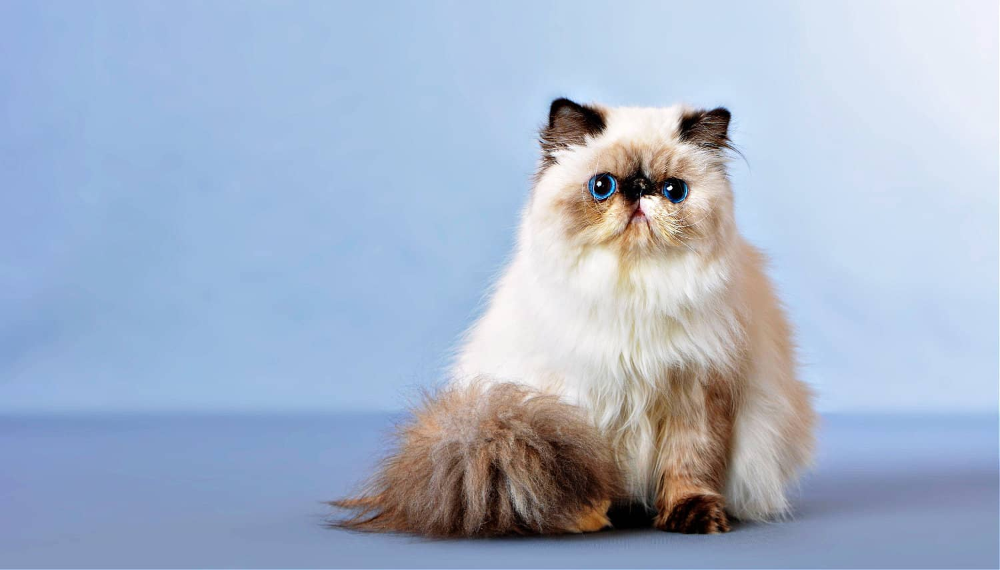

<!DOCTYPE html>
<html>
<head>
<title>Persian cats</title>
<link rel="stylesheet" href="https://www.w3schools.com/w3css/5/w3.css">

</head>
<body>
  <body style="background-color:rgb(221, 214, 213);">
  

  

    <a href="#home" class="w3-bar-item w3-button">Persian cats</a>
    

      <a href="#Persian longhair" class="w3-bar-item w3-button">Persian longhair</a>
      <a href="#Health" class="w3-bar-item w3-button">Health</a>
      <a href="#Funfacts" class="w3-bar-item w3-button">Funfacts</a>
    

  

<header class="w3-display-container w3-content w3-wide" style="max-width:1600px;min-width:500px">
  
  

    <h1 class="w3-xxlarge">Persian cats</h1>
  

</header>
  

    

     
    

     

      <h1 class="w3-center">Persian longhair</h1> 
      
Persians have distinctive long, elegant fur coats. However, not all long-haired cats are Persians. The Persian is instead characterized by large, round eyes, a short (almost flat) nose, and broad head. They have a dense, fluffy coat that comes in a variety of colors and patterns. While white Persian cats have been prominently displayed in media, these beautiful kitties can come in a range of solid colors or shaded, bi-color, tabby, and Himalayan (colorpoint) patterns. Their bodies are more thick than sleek, with some describing them as having a "linebacker" build. With all that fluff, they look very huggable!

In terms of temperament, Persian cats are typically calm, affectionate, and gentle creatures. They enjoy lounging around the house and are known for their relaxed demeanor. Truly the aristocrat of the cat world, the Persian is sweet and affectionate but has a playful side too. Often you find these kittens entertaining themselves with a balled-up piece of paper, but they’ll happily engage in playtime with their people, especially if you have a cat toy they can chase.

While beautiful, Persians require regular grooming due to the length and density of their fur, which can mat if not properly cared for. Overall, Persian cats can make wonderful companions for those who appreciate their beauty and serene nature.

      
The origins of the Persian cat are clouded in mystery and myth. Legend has it that the Persian cat was a treasure in the ancient world, highly valued by those in the Persian empire and said to have been smuggled out of what is now modern-day Iran alongside spices and jewels. Though Persians are agreed to be an old breed, nobody is entirely sure where these cats first came from.

    

  

  

  

    

      <h1 class="w3-center">Health</h1> 
      <h4>Height & Weight</h4>
      
10-15 inches ; 7-13 pounds
 
    
      <h4>Lifespan and common health concerns</h4>
      
10-15 years ; Breathing issues, sin and coat disorders, kidney disease, eye problems,dental disease. 
 
    
      <h4>Temperament & energy level</h4>
      
Friendly ; calm.They are known to be relaxed and to enjoy bonding by sitting with humans and being petted rather than showing love through play, though they certainly do have occasional bursts of energy. 
 
    
      <h4>Brachycephalic Airway Syndrome</h4>
      
Brachycephalic airway syndrome is a group of upper airway issues often seen in flat-faced cats and dogs. Brachycephalic breeds often have trouble breathing due to physical traits such as narrowed nostrils, an elongated soft palate, or larynx (voice box) collapse.This condition can limit a Persian's ability to exercise and tolerate heat, particularly in overweight cats, senior cats.
 
    
      <h4>Hydrocephalus</h4>
      
Persian kittens with extreme brachycephaly are at a higher risk of developing hydrocephalus, an abnormal expansion and accumulation of cerebrospinal fluid (CSF) in the cavities of the brain.

Signs of congenital hydrocephalus typically appear within the first few weeks to a year after birth and include seizures, a dome-shaped head, abnormal breathing, and failure to thrive.
    
    

    
    

      
    

    

      
    

  

  

  

    <h1>Funfacts</h1> 
      <h4>Persian Cats Came From Persia ... Possibly</h4>
      
The exact origins of the Persian cat are obscure. But it came to the attention of Europeans when diplomats stationed in the Middle East brought the first long-haired cats back to England and other European countries in the mid-1800s. Two of the best-known cats were Persians from Iran (seat of the ancient Persian Empire) and Angoras named for Ankara in Turkey. These long-haired beauties, both Persian and Angora cats, were an immediate hit with Westerners. The Persian cat was immediately prized for its exotic looks and named for its presumed homelands.
 
    
      <h4>Persian cats are being favored by royalty? </h4>
      
 Queen Victoria of England is said to have been fond of Persian cats, contributing to their popularity in the Victorian era.Their luxurious appearance aligned well with the Victorian ideal of refinement and beauty.
 
    
      <h4>The breed is known as the Persian Longhair in most countries but is also known as the Iranian Cat or the Shiraz Cat.</h4>
      
The Persian cat, also widely known as the Persian Longhair in English-speaking countries, is a breed with a rich history and multiple names reflecting its origins and cultural significance. While "Persian Longhair" is the most commonly used term in breed registries and cat fancier organizations, the cat is also referred to as the Iranian Cat, especially in its native region, to emphasize its true geographic roots in modern-day Iran (formerly Persia). Another poetic and culturally significant name for the breed is the Shiraz Cat, named after the city of Shiraz in Iran, known for its historical association with art, poetry, and beauty. These alternate names not only highlight the breed’s exotic and elegant image but also reflect the different cultural lenses through which the Persian cat has been viewed over time.

 
    
      <h4>The males of this breed tend to be on the more affectionate side, while the females act a bit more aloof.</h4>
      
According to many breeders and Persian cat owners, there is a noticeable difference in temperament between the sexes of this breed. Male Persian cats are often described as more affectionate, sociable, and people-oriented, frequently seeking out attention and enjoying being close to their human companions. In contrast, female Persians tend to be a bit more independent and aloof, often displaying a more reserved nature. While both sexes are typically calm and gentle, this subtle difference in behavior is something many enthusiasts have observed, making it a consideration for prospective owners when choosing a pet that best fits their lifestyle.
 
    

</body>
</html>
